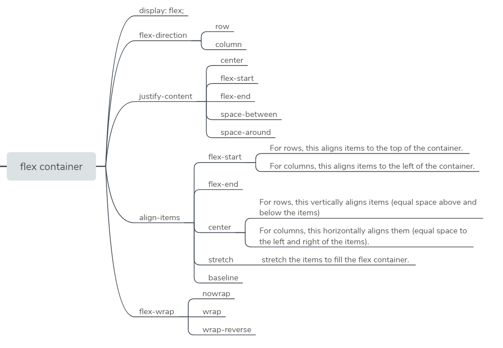

本文总结的是应用于 flex container 的 CSS 属性



## flex container

To start using the Flexbox model, you need to first define a flex container. The flex container becomes flexible by setting the display property to flex.

```css
.container {
  display: flex;
}
```

## flex-direction

The `flex-direction` property specifies the direction of the flexible items. If the element is not a flexible item, the flex-direction property has no effect.

Property Values

- `row`
- `row-reverse`
- `column`
- `column-reverse`

参考资料：

- [CSS flex-direction Property](https://www.w3schools.com/cssref/css3_pr_flex-direction.asp)

## Align Flexible Items

A flex container set as a column places the flex items in a vertical stack from top-to-bottom. For each, the direction the flex items are arranged is called the main axis. For a row, this is a horizontal line that cuts through each item. And for a column, the main axis is a vertical line through the items.


### justify-content

The justify-content property aligns the flexible container's items when the items do not use all available space on the main-axis.

```css
.container {
  display: flex;
  justify-content: center;
}
```

Property Values:

- `flex-start`
- `flex-end`
- `center`
- `space-between`: aligns items to the center of the main axis, with extra space placed between the items. The first and last items are pushed to the very edge of the flex container. For example, in a row the first item is against the left side of the container, the last item is against the right side of the container, then the other items between them are spaced evenly.
- `space-around`: similar to `space-between` but the first and last items are not locked to the edges of the container, the space is distributed around all the items

参考资料：

- [Align Elements Using the justify-content Property](https://learn.freecodecamp.org/responsive-web-design/css-flexbox/align-elements-using-the-justify-content-property/)
- [CSS justify-content Property](https://www.w3schools.com/cssref/css3_pr_justify-content.asp)

### align-items

CSS offers the `align-items` property to align flex items along the cross axis. For a row, it tells CSS how to push the items in the entire row up or down within the container. And for a column, how to push all the items left or right within the container.

Property Values:

- `flex-start`
- `flex-end`
- `center`
- `stretch`(default): stretch the items to fill the flex container. For example, rows items are stretched to fill the flex container top-to-bottom.
- `baseline`: align items to their baselines. Baseline is a text concept, think of it as the line that the letters sit on.

参考资料：

- [Align Elements Using the align-items Property](https://learn.freecodecamp.org/responsive-web-design/css-flexbox/align-elements-using-the-align-items-property)
- [align-items](https://css-tricks.com/almanac/properties/a/align-items/)

## flex-wrap

CSS flexbox has a feature to split a flex item into multiple rows (or columns). By default, a flex container will fit all flex items together. For example, a row will all be on one line.

However, using the `flex-wrap` property, it tells CSS to wrap items. This means extra items move into a new row or column. The break point of where the wrapping happens depends on the size of the items and the size of the container.

Property Values

- nowrap
- wrap
- wrap-reverse

参考资料：

- [Use the flex-wrap Property to Wrap a Row or Column](https://learn.freecodecamp.org/responsive-web-design/css-flexbox/use-the-flex-wrap-property-to-wrap-a-row-or-column)
