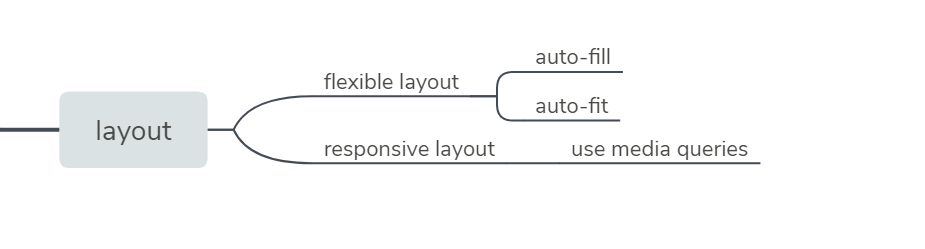

## Create Flexible Layouts

### auto-fill

The repeat function comes with an option called `auto-fill`. This allows you to automatically insert as many rows or columns of your desired size as possible depending on the size of the container. You can create flexible layouts when combining `auto-fill` with `minmax`.

```css
.container {
  display: grid;
  grid-template-columns: repeat(auto-fill, minmax(60px, 1fr));
}
```

When the container changes size, this setup keeps inserting 60px columns and stretching them until it can insert another one.

**Note**

If your container can't fit all your items on one row, it will move them down to a new one.

### auto-fit

`auto-fit` works almost identically to `auto-fill`. The only difference is that when the container's size exceeds the size of all the items combined, `auto-fill` keeps inserting empty rows or columns and pushes your items to the side, while `auto-fit` collapses those empty rows or columns and stretches your items to fit the size of the container.

```css
.container {
  display: grid;
  grid-template-columns: repeat(auto-fit, minmax(60px, 1fr));
}
```

**Note**

If your container can't fit all your items on one row, it will move them down to a new one.

## Create Responsive Layouts

CSS Grid can be an easy way to make your site more responsive by using media queries to rearrange grid areas, change dimensions of a grid, and rearrange the placement of items.

参考资料：

- [Use Media Queries to Create Responsive Layouts](https://learn.freecodecamp.org/responsive-web-design/css-grid/use-media-queries-to-create-responsive-layouts/)
